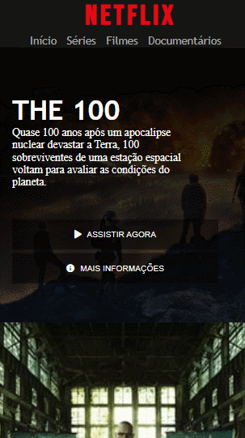

# Interface Netflix com carrossel de filmes

### Projeto feito durante o bootcamp Localiza Labs React Developer, na Digital Onovation One

## Ferramentas: 
* HTML
* CSS
* JavaScript
* Jquery

##  Demosntração:

